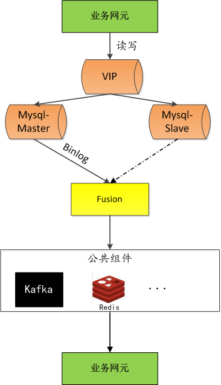

# Fusion
实现mysql replication功能，mysql数据变化实时同步到kafka 或者 redis。

## 功能说明
[中文](doc/sds.md)

## 使用说明
[中文](doc/releasenotes.md)

## Architecture

## Company
[聚好看](https://www.juhaokan.org/#/home)（聚好看科技股份有限公司）是海信集团下属的家庭互联网AI公司，成立于2016年7月。聚好看科技致力于成为领先的家庭互联网AI公司，为全球亿万家庭提供场景化服务。
2018--2020连续3年被评为“中国独角兽企业”，成为行业里程碑。

## Authors
* [@juhaokan](https://github.com/juhaokan)
* [@liuxianpan01](https://github.com/liuxianpan01)

## License
Codis is licensed under MIT， see MIT-LICENSE.txt
